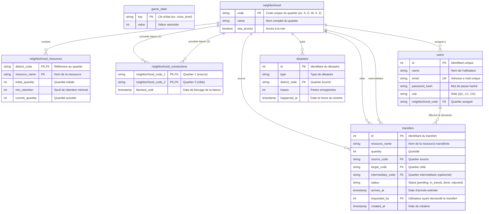

```mermaid
erDiagram
    game_state {
        string key PK "Clé d'état (ex: crisis_level)"
        int value "Valeur associée"
    }

    neighborhood {
        string code PK "Code unique du quartier (ex: A, E, W, X, Z)"
        string name "Nom complet du quartier"
        boolean sea_access "Accès à la mer"
    }

    neighborhood_resources {
        string district_code PK, FK "Référence au quartier"
        string resource_name PK "Nom de la ressource"
        int initial_quantity "Quantité initiale"
        int min_retention "Seuil de rétention minimal"
        int current_quantity "Quantité actuelle"
    }

    neighborhood_connections {
        string neighborhood_code_1 PK, FK "Quartier 1 (source)"
        string neighborhood_code_2 PK, FK "Quartier 2 (cible)"
        timestamp blocked_until "Date de blocage de la liaison"
    }

    users {
        int id PK "Identifiant unique"
        string name "Nom de l'utilisateur"
        string email UK "Adresse e-mail unique"
        string password_hash "Mot de passe haché"
        string role "Rôle (QC, LC, CD)"
        string neighborhood_code FK "Quartier assigné"
    }

    transfers {
        int id PK "Identifiant du transfert"
        string resource_name "Nom de la ressource transférée"
        int quantity "Quantité"
        string source_code FK "Quartier source"
        string target_code FK "Quartier cible"
        string intermediary_code FK "Quartier intermédiaire (optionnel)"
        string status "Statut (pending, in_transit, done, rejected)"
        timestamp arrives_at "Date d'arrivée estimée"
        int requested_by FK "Utilisateur ayant demandé le transfert"
        timestamp created_at "Date de création"
    }

    disasters {
        int id PK "Identifiant du désastre"
        string type "Type de désastre"
        string district_code FK "Quartier touché"
        int losses "Pertes enregistrées"
        timestamp happened_at "Date et heure du sinistre"
    }

    neighborhood ||--o{ neighborhood_resources : "contient"
    neighborhood ||--o{ neighborhood_connections : "possède liaison (1)"
    neighborhood ||--o{ neighborhood_connections : "possède liaison (2)"
    neighborhood ||--o{ users : "assigné à"
    neighborhood ||--o{ transfers : "source"
    neighborhood ||--o{ transfers : "cible"
    neighborhood ||--o{ transfers : "intermédiaire"
    users ||--o{ transfers : "effectue la demande"
    neighborhood ||--o{ disasters : "subit"
```